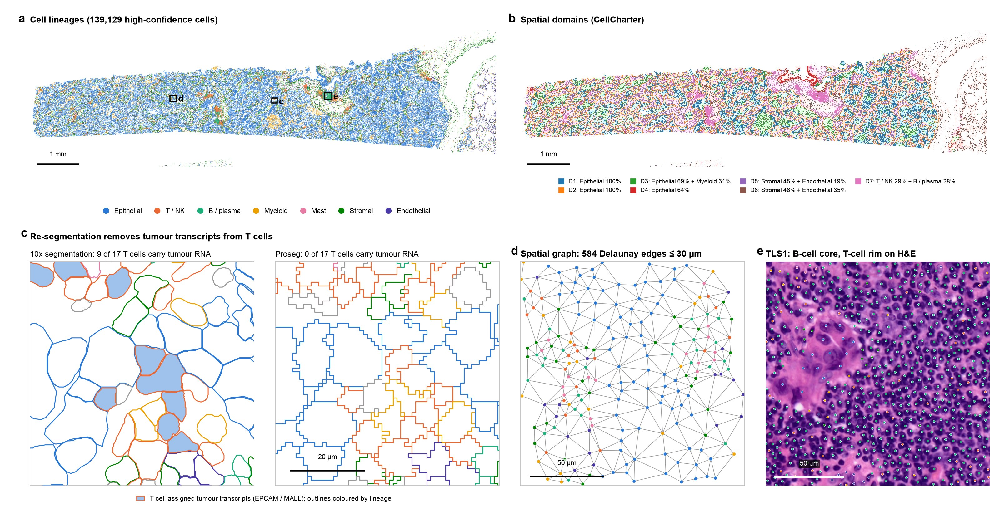
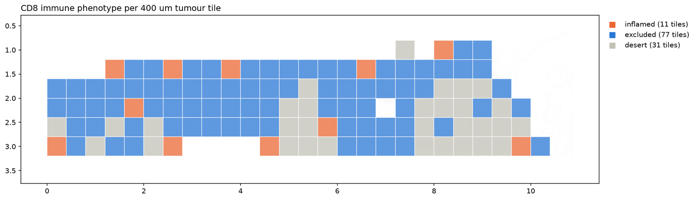
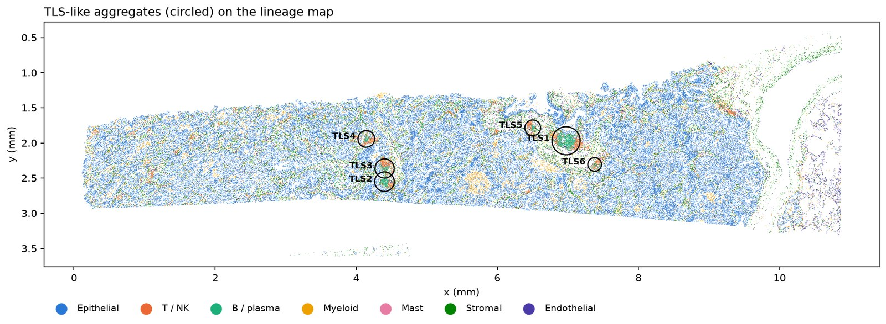
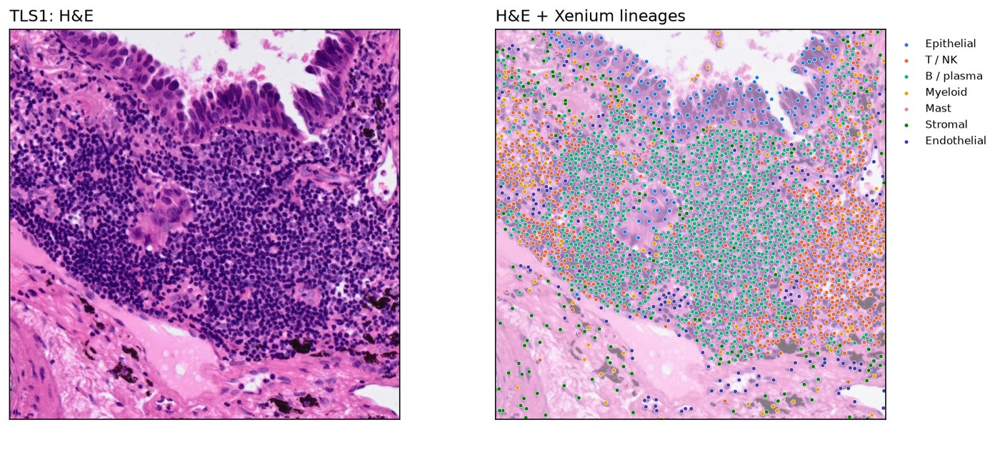
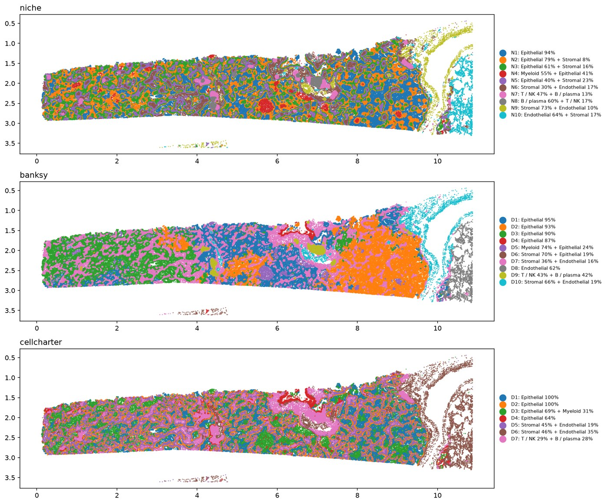
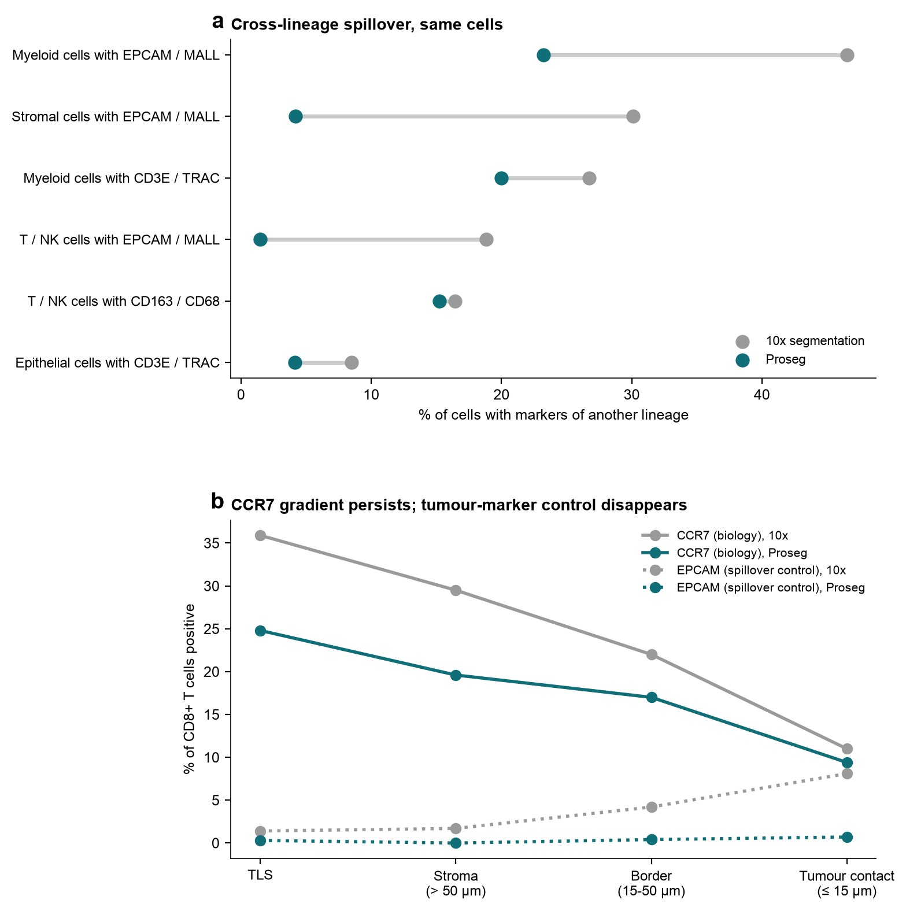
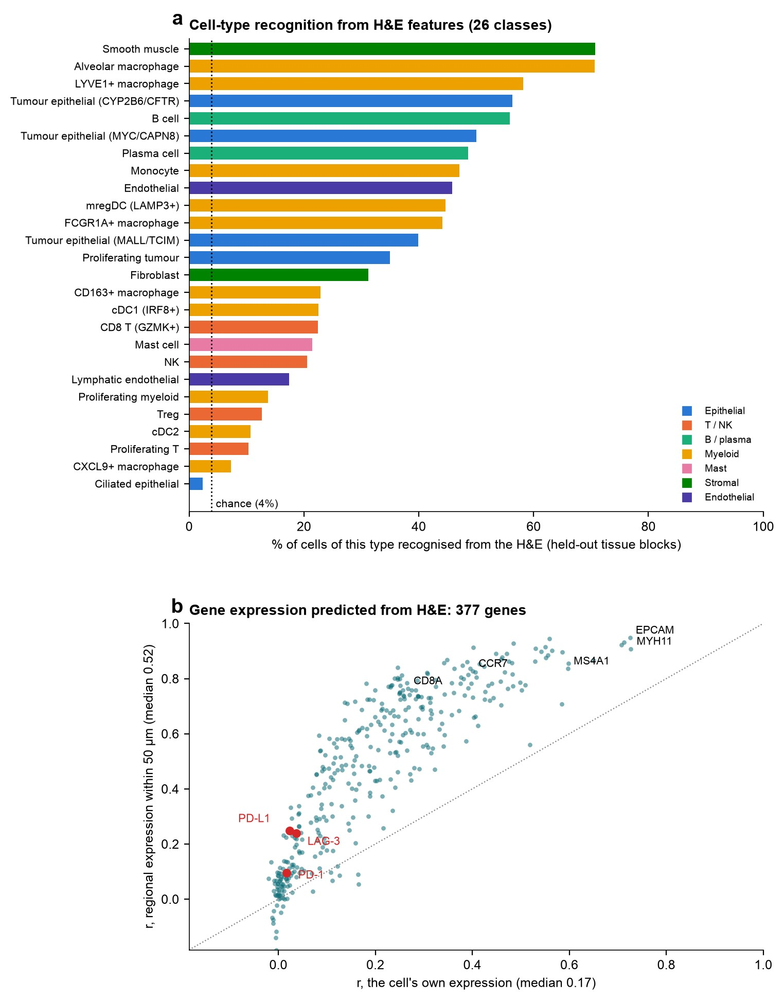
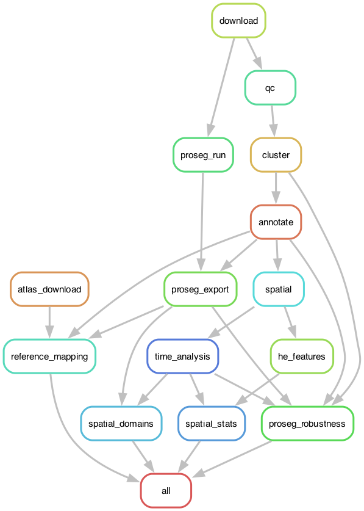

# Mapping the Immune Landscape of Lung Cancer with Xenium Spatial Transcriptomics

**MD Shakhaowat Hossain** · PhD Candidate, Tulane University School of Medicine

[](https://github.com/hossainms/xenium-human-lung-cancer-ffpe/actions/workflows/ci.yml)
  

*Where are immune cells located within a lung tumour, and which findings hold up under critical evaluation?*

An end-to-end, single-cell analysis of the tumour immune microenvironment in the 10x Genomics **Xenium In Situ** public dataset *Human Lung Cancer FFPE* (lung adenocarcinoma; 377-gene panel, ~162,000 cells), with every key finding tested against technical artefacts. It is built three ways: Python **notebooks**, an independent **R / Bioconductor** replication and a reproducible **Snakemake pipeline** that regenerates every result from the raw download, all sharing one tested Python package, `ist_analysis`.

**Project website: [hossainms.github.io/xenium-human-lung-cancer-ffpe](https://hossainms.github.io/xenium-human-lung-cancer-ffpe/)**, with the rendered notebooks, the pipeline report and an [interactive cell viewer](https://vitessce.io/#?url=https://hossainms.github.io/xenium-human-lung-cancer-ffpe/viewer/config.json) (Vitessce: 139,129 cells in tissue and UMAP space, coloured by cell type, niche, domain, TLS or any gene).



**Figure 1. Spatial organisation of a lung adenocarcinoma section and the main analysis steps.** **a**, Cell lineages of 139,129 high-confidence cells. Boxes indicate the regions shown in c-e. Scale bar, 1 mm. **b**, Spatial domains identified with CellCharter. Scale bar, 1 mm. **c**, Cell segmentation at a tumour-T cell interface (120 x 120 µm; the window where tumour and T-cell transcripts meet most densely), shown on DAPI for the vendor (10x, left) and Proseg (right) segmentations. Magenta outlines mark T cells that the method assigned tumour transcripts (EPCAM, MALL): 23 of 159 with 10x vs. 1 of 157 with Proseg; across the section, 18.8% vs. 1.5% of T / NK cells. Proseg cells inherit the lineage of the matching 10x cell. Scale bar, 20 µm. **d**, Delaunay spatial neighbourhood graph (edges ≤ 30 µm) at a tumour-stroma-immune border (150 x 150 µm). Scale bar, 50 µm. **e**, Tertiary lymphoid structure TLS1 on the matched H&E (160 x 160 µm), with Xenium cell centroids coloured by lineage. Scale bar, 50 µm. Lineage colours are shared across a and c-e. Generated by `site/overview_figure.py`.

## Key findings

**1. Predominantly CD8-excluded tumour regions.** Only 12% of CD8+ T cells were located within 15 µm of a tumour cell, compared with 34% of non-tumour cells overall. Macrophages, dendritic cells and fibroblasts were prominent along the tumour boundary. At the 400 µm tile scale, 65% of tumour-containing tiles were classified as immune-excluded, 26% as immune deserts and 9% as inflamed. Python and R analyses produced identical tile classifications. Together, these results suggest a predominantly CD8-excluded spatial pattern in this tissue section, with relatively few inflamed regions.



**2. Six TLS-like aggregates show organised lymphoid architecture.** Six tertiary lymphoid structure (TLS)-like aggregates were identified across the tissue section. These aggregates featured B-cell-rich cores surrounded by T-cell rims; the largest (TLS1) showed the corresponding lymphoid architecture on the matched H&E. The proportion of CCR7-expressing CD8+ T cells was 36% within the aggregates and 11% at the tumour border (within 15 µm of tumour cells). Contacts between CCL19-expressing and CCR7-expressing cells were enriched 2.4-fold relative to a spatial permutation null that shuffles expression within cell types, and the CCR7 difference persisted after cell re-segmentation. Together, these results are consistent with organised lymphoid niches in this section, with distinct CD8+ T-cell states near the aggregates and at the tumour border.




**3. FCGR1A+ macrophage expression varies by spatial domain.** Paired pseudobulk DESeq2 analysis of BANKSY- and CellCharter-defined domains found higher TREM2, CTSK and LPL expression in stromal FCGR1A+ macrophages, and higher MARCO, MCEMP1 and CXCL2 expression in tumour-adjacent macrophages. Of 60 initially significant genes, 42 were excluded because their signals were attributable to neighbouring-cell transcripts. The remaining differences persisted with re-segmented counts. These findings indicate location-associated expression differences within this section. However, the 1 mm tissue blocks are not independent biological replicates, making the p-values optimistic; functional consequences were not tested.



**4. Main findings persist after cell re-segmentation.** Proseg re-segmentation reduced the proportion of T / NK cells containing neighbouring epithelial transcripts from 19% to 1.5%. CD8 exclusion persisted (12% versus 34% within 15 µm of tumour cells), all six TLS-like aggregates were re-identified within 3–9 µm of their original locations, and CCR7 expression remained higher in CD8+ T cells within the aggregates than at the tumour border (25% versus 9%). Lineage annotations agreed with the Lung Cancer Atlas (LuCA; 892,000 cells) for 92% of high-confidence cells. These checks support robustness to segmentation spillover within this tissue section; they do not establish consistency across patients.



**5. H&E features predict lineage better than immune states.** Features from Phikon-v2, a pathology foundation model, extracted at each cell’s position on the matched H&E predicted cell lineage with 57% balanced accuracy in spatially held-out tissue blocks, compared with 14% chance accuracy and 45% for a Xenium-neighbour-based control. Cell-type prediction reached 34% balanced accuracy, compared with 4% chance accuracy. Recognition was highest for epithelial cells (90%), smooth muscle cells and alveolar macrophages (71% each), but low for regulatory T cells (13%) and CXCL9+ macrophages (7%). Regional gene expression was better predicted than single-cell expression (median r = 0.52 versus 0.17); checkpoint transcripts PD-1, PD-L1 and LAG-3 showed little predictive signal (r ≤ 0.04). These findings describe the performance of one model’s H&E features in this tissue section, not the general limits of histology.



## The analysis, three ways, one implementation

All analysis logic lives in one Python package, **`ist_analysis`**: analysis functions for **imaging-based spatial transcriptomics (iST)**, the platform family of Xenium, MERSCOPE and CosMx. Everything specific to one platform's output files sits in an adapter, `ist_analysis/io/xenium.py` (loading the bundle, imaging tiles, negative-control probes, pixel size, the vendor's own clustering); every other module works on a standard AnnData (counts, cell centroids in µm, cell metadata), so another iST platform needs one new adapter, not new analysis code. The Python notebooks (narrative, figures, interpretation) and the Snakemake scripts (reproducible batch runs) both call the same functions, so every result has a single implementation, covered by unit tests.

| Form | Where | Use it to |
|---|---|---|
| **Package** | `ist_analysis/` (QC, clustering, annotation, spatial statistics, H&E, TIME, re-segmentation, reference mapping, domains; Xenium adapter in `io/`) | reuse the methods; read the implementation |
| **Notebooks** (Python) | `notebooks/01_core_python.ipynb` (Steps 1-10), `notebooks/02-05` | read the analysis with figures and interpretation |
| **Notebook** (R / Bioconductor) | `notebooks/01_core_R.ipynb` | an independent replication in R (Seurat, SpatialExperiment, imcRtools, Banksy, CellChat, spatstat), cross-checked against Python step by step |
| **Snakemake pipeline** | `workflow/`, `config/` | re-run everything reproducibly from the raw download |

## What the analysis does

| Step | Content | Main tools |
|---|---|---|
| 1-2 | Download and inspect the 10x output bundle | `requests`, `pyarrow`, `tifffile` |
| 3-4 | Load, per-cell and per-tile quality control | `spatialdata-io`, `scanpy` |
| 5 | Normalisation, PCA, Leiden clustering, UMAP, markers | `scanpy` |
| 6 | Cell-type annotation (marker scores, lineage subclustering) | `scanpy` |
| 7 | Spatial graph, neighbourhood enrichment, niches, tumour distances, TLS-like aggregates | `squidpy`, `scikit-learn` |
| 8 | H&E alignment check and per-cell stain features | `tifffile`, `scikit-image` |
| 9 | Checkpoints, CD8 T-cell states by location, ligand-receptor contacts, immune phenotypes | permutation tests |
| 10 | Moran's I, co-occurrence, Ripley's L, centrality, `ligrec` | `squidpy`, OmniPath |
| 02 | Cell re-segmentation and robustness of the findings | Proseg |
| 03 | Validation of cell types against the Lung Cancer Atlas (LuCA) | logistic regression (CellTypist model) |
| 04 | Spatial domains and location-dependent macrophage states | BANKSY, CellCharter, PyDESeq2 |
| 05 | What a pathology foundation model sees in the H&E: cell types, genes and domains from morphology | Phikon-v2 (PyTorch, transformers) |

## The pipeline



Each box is a Snakemake rule (one script); arrows are file dependencies. The core chain runs download -> QC -> clustering -> annotation -> spatial analysis, with H&E, TIME and spatial statistics after it; Proseg re-segmentation branches off the raw data and feeds the robustness test, the atlas mapping and the domain analysis. Regenerate the graph with `snakemake --rulegraph | dot -Tpng > workflow/rulegraph.png`.

## Running the pipeline

**1. Environments** (conda; Apple Silicon and Linux tested with conda-forge packages):

```bash
conda env create -f workflow/envs/spatial_env.yml      # analysis environment (Python 3.12, scverse stack)
conda env create -f workflow/envs/snakemake_env.yml    # orchestrator (Snakemake 9)
conda run -n spatial_env pip install --no-deps -e .    # the ist_analysis package (used by notebooks and pipeline)
```

Notebook 02 also needs [Proseg](https://github.com/dcjones/proseg) (`cargo install proseg`), unless an earlier run is reused (`proseg.reuse` in the config).

**2. Configure** `config/config.yaml`: data and results locations (default `~/data/xenium_lung/`, outside the repository), and every analysis parameter. Cell-type label decisions are in `config/annotation.yaml`.

**3. Run** from the repository root:

```bash
conda activate snakemake_env
snakemake -n                     # dry run: list the jobs
snakemake --cores 8 core         # core workflow, Steps 1-10
snakemake --cores 8              # everything, including notebooks 02-05
snakemake --cores 8 annotate     # stop after one step
snakemake --cores 8 --forcerun qc   # re-run the analysis from QC on, keeping the downloads
```

Avoid `--forceall`: it would also re-run the downloads (Snakemake deletes a rule's outputs before re-running it). The 12.9 GB atlas is marked `protected` for that reason.

Each rule runs a script in `workflow/scripts/` inside `spatial_env` (via `conda run`). The scripts also run on their own, e.g. `python workflow/scripts/qc.py --marker <flag> --output qc.h5ad`.

**Outputs** (under `results:` in the config): one `.h5ad` per step, `figures/`, `tables/`, `logs/`, and `xenium_explorer/` cell-group CSVs (cell types, lineages, niches, domains) that load into Xenium Explorer.

**Report:** `python workflow/make_report.py report.html` (in `snakemake_env`) builds a self-contained HTML page with the workflow graph, runtimes, and the key figures and tables of every step, each with a caption (`workflow/report/`) and the code and parameters that produced it. It wraps `snakemake --report` and replaces local paths with `~`, so the page can be shared.

**Website:** `python site/build_site.py` (in `spatial_env`) renders the notebooks, copies the report and writes the viewer data (AnnData zarr and Vitessce configuration) to `~/data/xenium_lung/site/`; `bash site/deploy.sh` publishes it to the `gh-pages` branch.

**Tests:** `pytest` runs unit tests of the package on small synthetic datasets with known answers (QC rules, TLS detection, the contact test, the spillover filter, domain naming, reference-mapping helpers, annotation guards). GitHub Actions runs linting, the tests and a Snakemake dry run on every push.

**Inspecting the workflow:** `snakemake -n` (what would run, and why), `snakemake --summary` (every output, the rule that made it, whether it is up to date).

**Approximate runtimes** on an 8-core laptop: core workflow ~15 min; Proseg ~30 min (~13 GB RAM); atlas download 12.9 GB, then ~20 min for the first panel-gene cache; spatial domains ~12 min.

## Repository layout

```
notebooks/01_core_python.ipynb           core analysis, Python (Steps 1-10)
notebooks/01_core_R.ipynb                core analysis, R / Bioconductor (independent replication)
notebooks/02-05                          side analyses (re-segmentation, reference mapping, spatial domains, H&E foundation model)
ist_analysis/                            the iST analysis package (shared by notebooks and pipeline)
ist_analysis/io/xenium.py                Xenium adapter: the only platform-specific code
tests/                                   pytest unit tests on synthetic data
workflow/Snakefile                       pipeline rules
workflow/scripts/                        one script per step
workflow/envs/                           conda environment files
workflow/report/                         report captions
workflow/make_report.py                  shareable HTML report (local paths removed)
workflow/rulegraph.png                   pipeline diagram
config/                                  pipeline parameters and annotation decisions
site/                                    project website: landing page, build and deploy scripts
.github/workflows/ci.yml                 lint + tests + pipeline dry run
pyproject.toml                           package metadata, lint and test settings
LICENSE, LICENSE-CC-BY-4.0.md, CITATION.cff
spatial_transcriptomic_analysis_*_packages.md   environment documentation (Python, R)
```

## Data and attribution

Raw data and results are never stored in this repository; the pipeline downloads them.

| Dataset | Source | Licence |
|---|---|---|
| [Xenium Human Lung Cancer FFPE](https://www.10xgenomics.com/datasets/preview-data-ffpe-human-lung-cancer-with-xenium-multimodal-cell-segmentation-1-standard) (Xenium v1, Human Multi-Tissue and Cancer panel; adult lung adenocarcinoma) | 10x Genomics, public datasets | [CC BY 4.0](https://creativecommons.org/licenses/by/4.0/) |
| Lung Cancer Atlas (LuCA), core atlas | [Salcher et al., *Cancer Cell* 2022](https://doi.org/10.1016/j.ccell.2022.10.008), via CELLxGENE | [CC BY 4.0](https://creativecommons.org/licenses/by/4.0/) |

Methods used and cited: Proseg (Jones et al., *Nature Methods* 2025), BANKSY (Singhal et al., *Nature Genetics* 2024), CellCharter (Varrone et al., *Nature Genetics* 2024), CellTypist (Dominguez Conde et al., *Science* 2022), squidpy (Palla et al., *Nature Methods* 2022), scanpy, spatialdata, PyDESeq2, and in R: Seurat, SpatialExperiment, imcRtools, Banksy, SingleR, CellChat, spatstat. See `CITATION.cff`.

## Author and citation

Design, analysis, code and interpretation: **MD Shakhaowat Hossain**, PhD Candidate, Tulane University School of Medicine.

If you use this analysis or its code, please cite it (GitHub's "Cite this repository" button reads `CITATION.cff`):

> Hossain, M. S. (2026). *Xenium human lung cancer (FFPE): Spatial analysis of the tumour immune microenvironment* (Version 1.1.0) [Computer software]. GitHub. https://github.com/hossainms/xenium-human-lung-cancer-ffpe

and cite the datasets and methods listed above.

**Using this work?** I would be glad to hear how you are applying the analysis or code, and happy to answer questions or discuss related ideas. Feel free to reach out at [shakhaowatdu@gmail.com](mailto:shakhaowatdu@gmail.com).

## Licence

© 2026 MD Shakhaowat Hossain. Code: MIT (`LICENSE`). Text, figures and result tables: CC BY 4.0 (`LICENSE-CC-BY-4.0.md`). The datasets keep their own licences (above).
